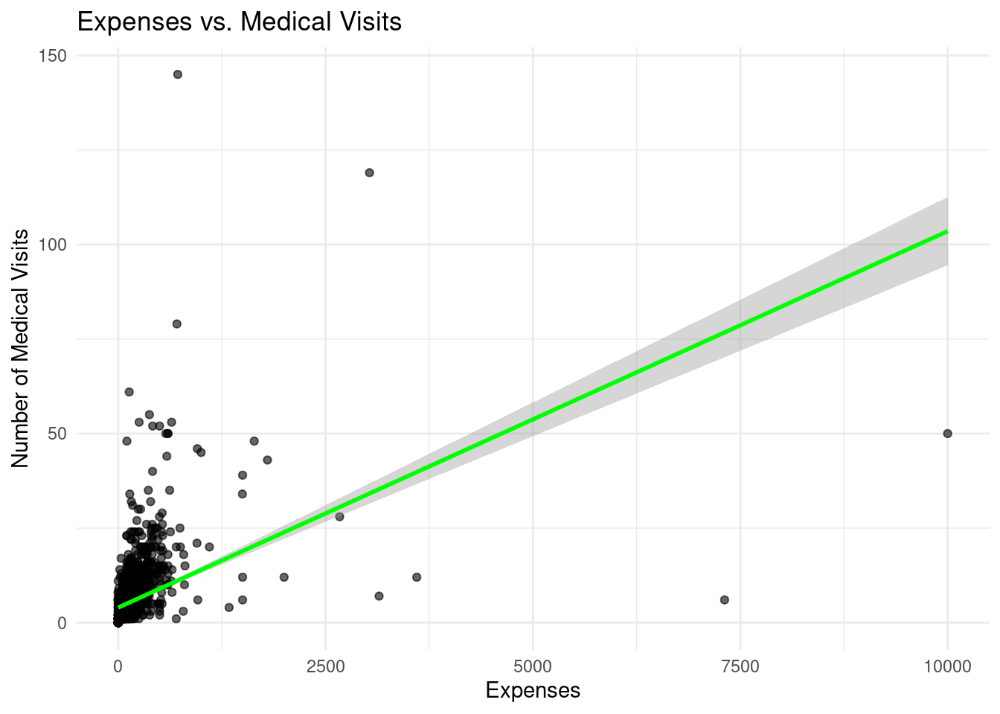

# Out-of-Pocket Expenditure and Copayments vs. Medical Visits: Multi-Variable Linear Regression

### Abstract

This study investigates the impact of demographic factors—age, gender, income, and city background—on healthcare utilization, particularly the number of medical visits, across different insurance schemes. Using both Negative Binomial (NB) and Linear Model (LM) regressions, the analysis highlights how out-of-pocket expenditure (OOP), insurance coverage, and income influence healthcare use and financial burden. Results show that a 1% increase in out-of-pocket expenditure is associated with a 0.4 to 1.6 decrease in the number of medical visits annually, depending on income levels. While the negative coefficient for OOP costs (-0.4 to -1.6, p<0.01) is significant in both models, the effect is more pronounced in the LM, indicating a potential linear relationship at higher OOP levels. Conversely, small increases in dollar-based medical expenses led to a slight increase in visits, suggesting a threshold effect where low OOP costs do not deter care.

### Key Findings

Insurance coverage also plays a key role, with individuals having high coverage showing a reduction in medical visits (β = -0.22, p<0.05). This suggests that comprehensive coverage may encourage better preventive care, reducing the need for frequent visits. In terms of income, the analysis finds a very small negative coefficient for income on hospital visits (β = -0.0001, p<0.05), implying that higher-income individuals may experience marginally fewer medical visits, likely due to access to preventive health measures and healthier lifestyles.

Significant racial disparities in healthcare utilization were identified. Spanish, Oriental, and Native American groups had fewer hospital visits (ranging from -0.12 to -0.29, p<0.05) compared to Black and White populations. Although the interaction between income and medical expenses was statistically significant (p<0.01), the effect size was negligible (β = 0.00003), indicating that the combined effect of these factors on medical visits is minimal.

These findings underscore the complexity of healthcare utilization, shaped by financial and demographic factors. Future research should further explore the threshold levels at which OOP costs deter healthcare visits and examine the cultural and systemic reasons behind the racial disparities observed. Understanding these dynamics is critical for designing policies that improve equitable access and efficient healthcare delivery across diverse populations.

### Introduction

#### About Health Insurance

Health insurance models typically involve the insured paying premiums in exchange for coverage of medical expenses. This system includes deductibles—the fixed amount paid out-of-pocket before insurance coverage starts—and coinsurance, where costs are shared between the insurer and insured after deductibles are met. Such structures help individuals manage potential high medical costs by distributing the financial risk.

#### About RAND

The Health Insurance Experiment (HIE) conducted from 1974 to 1982 across six U.S. locations aimed to evaluate the impact of different health insurance strategies on service use and individual health outcomes. It focused on understanding how cost-sharing affects service utilization, satisfaction with care, quality of healthcare, and overall health. This led to the development of comprehensive health status monitoring across physical, mental, social, and physiological dimensions.

### Question of interest

*How do demographic factors such as age, gender, income, and city background impact the utilization of medical services within each insurance scheme (the quantity of medical visits).*

*What is the burden of healthcare among various variables?*

*How do those demographic factors impact the out-of-pocket expenditure or burden that healthcare brings?*

*Taking medical expenses as an out-of-pocket expenditure (OOP), how does OOP impact the quantity of medical visits.*

### Data

`Race`: Participants were categorized primarily as White, Black, or Other. This categorization aimed to capture demographic variability across different geographic regions involved in the study.

`Income`:

Income was measured for the year preceding enrollment and the second year preceding enrollment.

Logged family income (TINC) was also recorded to adjust for income disparities and analyze data on a logarithmic scale, which can be useful for handling skewed data.

Age: Age data was collected for all participants, enabling the study to segment results across different life stages and assess how age influences healthcare utilization.

`Expenses`:

`Medical expenses` (MDEKP) were recorded to evaluate healthcare spending patterns. Detailed information on expenses helped analyze the impact of different insurance plans on out-of-pocket costs.

`Medical Visits` (HDVIS): The frequency and type of medical visits were tracked, providing insight into healthcare utilization across different insurance coverage types and demographic groups.

`Insurance Plan` (PLAN): Participants were assigned to various insurance plans that varied by terms of coverage, out-of-pocket costs, and services covered. This component is crucial for assessing the effect of insurance plan characteristics on healthcare usage and expenses.


### Variables of interest

-   **Outcome variable: medical visits**

-   **Primary predictor variable: insurance coverage plan**

-   **Possible confounders: race, age, income, medical expenses out-of-pocket expenditure, city background**

-   **Potential effect modifiers:income, expenses**

### Directed acyclic graph (DAG)


### Exploratory Data Analysis

This section delves into how out-of-pocket expenditures and insurance coverage influence healthcare utilization and other demographic factors.

#### `Coverage_Category`

#### Insurance Coverage vs. City Background


##### Interpretation (`city_background` vs. `coverage_category`)

Summary: **Enrollment in low coverage plans is higher in rural and small-town areas, whereas full coverage plans are more common in urban settings. This suggests geographical differences in insurance preferences.**

Out of all of the coverage plans, low coverage is the most enrolled, hovering betweeen 40-50% within each city_type, followed by full coverage between 30-40%, high coverage at an even 20%, and medium coverage between 0-5%.

Uniquely, those enrolled in low coverage plans are proportionally higher in Small Town and Rural Area city types, those enrolled in full coverage plans are proportionally higher in Suburban and Urban city types, and those enrolled in full coverage plans are proportionally even across all city types. Medium coverage plans are the least popular in urban areas, followed by suburb, then rural, and small-town areas.

This signals that those in more remote areas are more likely to enroll in low coverage plans and those in more urban areas are more likely to enroll in high coverage plans.

#### Age vs. Coverage_Category


#### Interpretation (`age_group` vs. `coverage_category`)

Summary: **Older age groups tend to enroll in plans with more comprehensive coverage. Notably, the highest enrollment in full coverage occurs among the oldest demographics.**

As age (and age_group) increases(in magnitude), the proportion of those enrolled in full coverage increases. Additionally, in the youngest age group, the proportion of those enrolled in low coverage is the highest. High coverage plans are enrolled proportionally equal in each age group, and medium coverage plans are most popular among those in between 35-49.

#### Race vs. Coverage_Category


##### Interpretation (`race` vs. `coverage_category`)

Summary: **The distribution of insurance plan enrollment is consistent across racial groups, with low coverage plans being the most common. However, racial differences are apparent in the preference for medium and high coverage options.**

The pattern of enrollment proportion for each type of coverage plan is even between White and Black groups: medium coverage plans are the least popular, followed by high coverage, then full coverage, then finally, low coverage plans.

Notably, the White group has 12612 observations and the black group has 1789 observations. Other includes Spanish, Oriental, and blank, and only make up roughly 213 observations. As such, the bulk of this analysis will focus on the first two groups.

However, the proportion of individuals enrolled in low coverage plans and medium coverage plans is marginally higher in Black individuals vs. White individuals, and the proportion of individuals enrolled in full coverage plans are higher in White families compared to Black families.

#### Income vs. Coverage_Category


##### Interpretation (`income` vs. `coverage_category`)

The median income seems to be spread evenly between the four different types of coverage plans at around 12,500. When looking at the spread of the distribution of the box-and-whisker plot between the full coverage, high coverage, and low coverage plans, we find that the individual with the max income between these categories falls between \$30,000 and \$32,500. There does not seem to be a relationship between income and enrollment plan.


##### Interpretation (`medical visits` vs. `coverage_category`)

This graph was adjusted to zoom in between 0 and 40 in order to visualize the differences in the size of the IQR boxes. On average, we can see that those enrolled in the full coverage plans have the highest median number of visits at around 5, with those in high coverage and low coverage at the same level of \~4 visits. Those enrolled in medium coverage had the lowest median number of visits. High coverage, however, had the highest \# of medical visits at around 125. There does not seem to be a big relationship between insurance plan and medical visits.

### Income, Expenses, and OOP Expenditure vs. Medical Visits & Coverage Category

This section seeks to evaluate the relationship between the burden of medical care (out-of-pocket expenditure) within our demographic variables to account for effect modification.

##### Scatter Plot (Income vs. Medical Visits)


##### Scatter Plot (Medical Expenses vs. Medical Visits)



##### Scatter Plot (Medical Visits vs. OOP Expenditure)


#### Interpretation of Scatter Plots

As income increases, it seems the number of medical visits decreases. However, as medical expenses increase, the number of medical visits increases. Combining these two, I found that as the log(out-of-pocket expenditure) increases, the number of medical visits also increases. **Thus, it seems as if income certainly modifies the effect of medical expenses on the number of medical visits.**


#### Interpretation of Hexbin Plots

This is a hexbin plot that visualizes the relationship between two variables by displaying the density of clusters of data points relative to the outcome variable. Here, we can see that the majority of data points are clustered at a very small OOP expenditure, suggesting that the relationship displyed by the log (out-of-pocket-expenditure) vs. medical visits may be biased.

# Model Testing

The main models that I will be chosing between are a **multi-linear regression model** as well as a **negative binomial regression model**. I will be using the former as a baseline, given that my outcome variable, medical visits, is continuous, and I have verious confounders. *Additionally, I will be using a negative binomial regression model given that the variance/spread of my data is extremely greater than the mean, as seen by all of the box-and-whisker plots shown above.* I will not be using a Poisson model given that the variance of the medical visits counts is not equal to the mean.

## Multiple Linear Regression & Negative Binomial Regression AIC Scores


Based on the AIC Scores, we will go with Model 5 that includes an interaction variable between income and expenses along with the presence of all other variables present in the data visualizations. We will we go with the negative binomial regression results but I will stop display the regression results here.

### Regression Results

```{r prepare-model-results, include=FALSE}


## Interpretation of Results

For each additional increase in out-of-pocket expenditure percentage, the total number of medical visits per individual decreases by 4.39 (NB) and 19.4 (LM).

For each additional dollar increase in out-of-pocket expenditure percentage, the total number of medical visits per individual increases by 0.0038 (NB) and 0.023 (LM).

Being enrolled in a high health insurance coverage plan will reduce the number of medical visits by 0.127.

For every additional dollar in income, the total number of hospital visits decreases by 0.0000091.

Spanish, Oriental, and Native Americans visit the hospital 0.44 fewer times than their Black and White counterparts.

Effect modification between income and expenses was statistically significant but the magnitude of such effect is negligible.

## Conclusion

1.  Out-of-Pocket Expenditure Impact: The significant negative coefficients for out-of-pocket expenditure percentages in both Negative Binomial (NB) and Linear Model (LM) regressions indicate that as out-of-pocket costs increase, individuals tend to reduce their number of medical visits. This reduction is more pronounced in the LM model, suggesting a potentially linear relationship. On the other hand, when analyzed by dollar increase, there’s a slight increase in visits, which could imply that at lower expense levels, additional costs are not a deterrent to seeking care. This dual finding suggests a threshold effect where small increases in costs do not deter visits until they reach a certain level.

2.  Insurance Coverage Influence: The negative coefficient associated with high insurance coverage suggests that individuals with better coverage have fewer medical visits. This could indicate that comprehensive coverage might lead to better health management and preventive care, thus reducing the need for frequent medical visits.

3.  Income and Healthcare Utilization: The extremely small negative coefficient for income suggests that higher income slightly decreases hospital visits. This could be interpreted as higher-income individuals having better access to preventive measures and healthier lifestyles, which reduce the need for hospital visits.

4.  Racial Disparities in Healthcare Utilization: The analysis shows that Spanish, Oriental, and Native American groups have fewer hospital visits compared to their Black and White counterparts. This difference might highlight disparities in access to healthcare or variations in cultural attitudes towards medical treatment.

5.  Effect of Income and Expenses Interaction: The finding that the interaction between income and expenses has a statistically significant but negligible effect suggests that while there is some interaction between these variables affecting medical visits, the practical impact of this interaction is minimal. This could imply that the basic effects of income and expenses on healthcare utilization are more critical to understand than their interaction.

6.  Future Research Directions: Further studies could explore the threshold levels at which out-of-pocket expenses start deterring medical visits and how these thresholds vary across different income groups. Additionally, qualitative research into the reasons behind lower hospital visits by certain racial groups could provide deeper insights into underlying causes. This number should be treated carefully, given that most out-of-pocket expenditure percentages ranged between 0.1 to 0.4, which would correspond to a -0.4 to -1.6 decrease in the number of medical visits a year.
